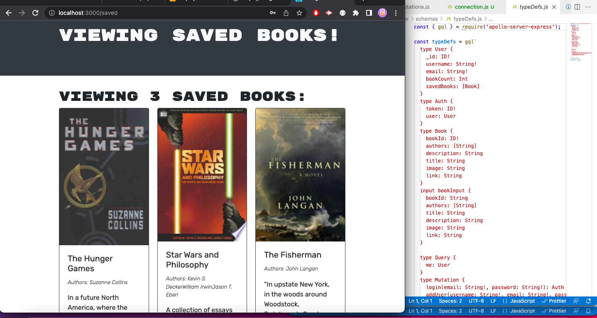

# Google Book Search

## Description

This app allows the user to search for their favorite books using a book search API and graphQL. The user is able to sign up and log in, When the user is logged in they are able to save their favorite books to their profile and also delete books from their profile.

## Demo

To see a demonstration of this application please clicke [here](https://drive.google.com/file/d/1l_KvlGm2Oyqvh7I0oCHtHHwjKlRrYhrd/view)